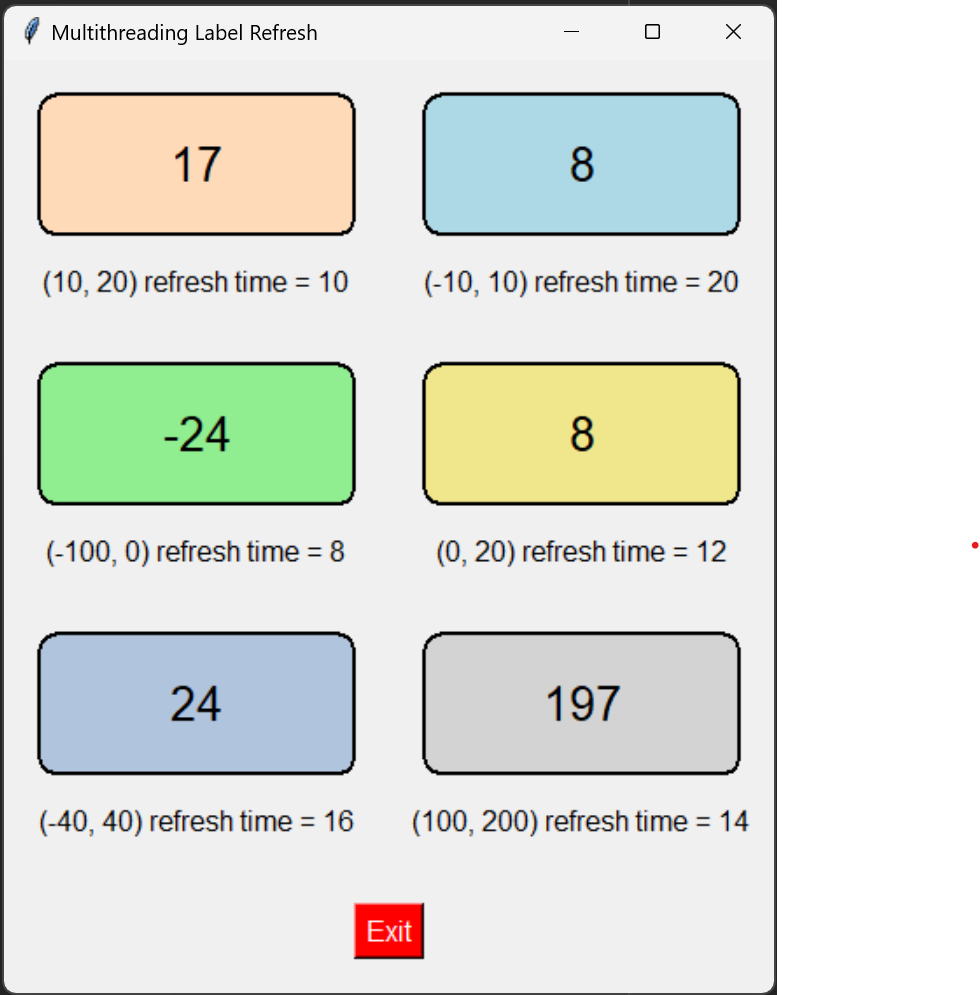

# Threading

This project is a Python Tkinter application that displays multiple labeled boxes.

Each box contains a numerical value that refreshes at a set interval and flashes a color change to indicate the refresh.

The refresh process is handled using multithreading to ensure smooth updates for each box.

## Authors

- [@Eshitva](https://www.github.com/Eshitva)

## Features

- **Flashing Colors**: The boxes briefly flash yellow when their values are refreshed, indicating an update.
- **Multithreading**: Each box is updated in its own thread, ensuring asynchronous updates without freezing the UI.
- **Exit Button**: A convenient exit button is provided to stop the application gracefully.

## Installation

### Prerequisites

- Python 3.x
- Tkinter (usually pre-installed with Python)

### Steps to Run

1. Clone the repository:

   ```ssh
   git clone https://github.com/Eshitva/MultiThreading
   cd your-repo-name
   ```
2. Run script
   ```ssh
   python ui-threading.py
   ```

## Screenshot


[](https://choosealicense.com/licenses/mit/)
